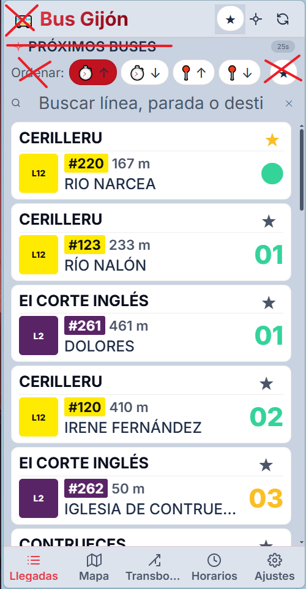
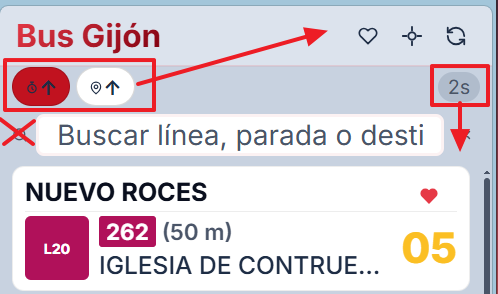
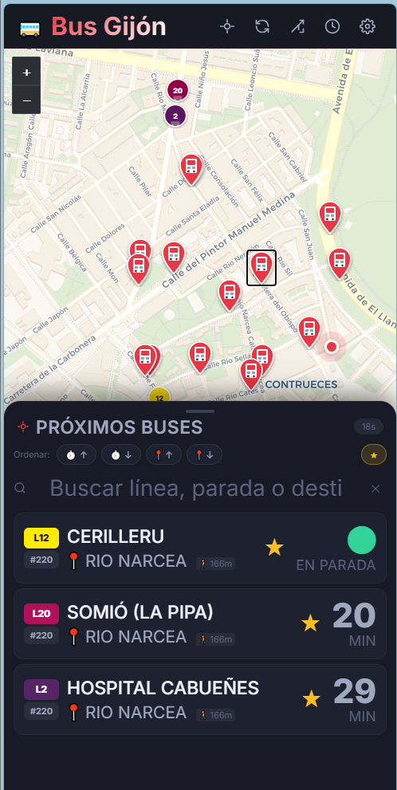
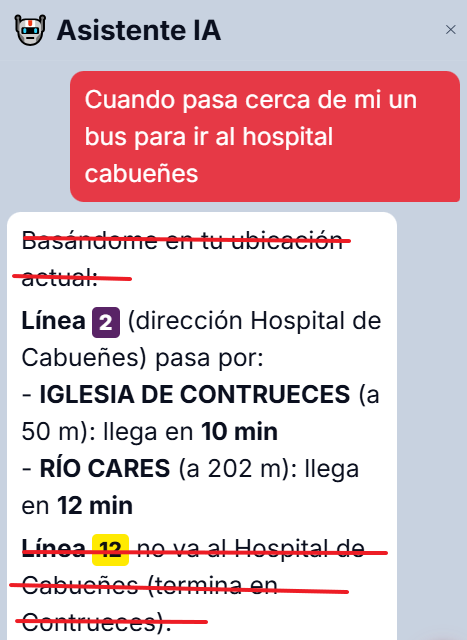

# Bus Gijón

PWA de llegadas de autobús en tiempo real para la red EMTUSA (Gijón, Asturias).



## Funcionalidades

- **Llegadas en tiempo real** — consulta los próximos autobuses de cualquier parada
- **Mapa interactivo** — visualiza paradas cercanas con Leaflet, tema oscuro/claro
- **Geolocalización** — filtra paradas por proximidad y muestra la distancia
- **Favoritos** — guarda tus paradas habituales
- **Modo transbordo** — agrupa llegadas por línea para planificar transbordos
- **Asistente IA** — chat con acciones rápidas (Anthropic, OpenAI, Deepseek, Gemini)
- **Refresco automático** — cuenta atrás configurable (30s – 30min), pausable
- **PWA instalable** — funciona como app nativa en móvil y escritorio
- **Accesible** — slider de tamaño de fuente (16–22px), alto contraste exterior

## Screenshots

| Tarjetas de llegada | Tema oscuro | Asistente IA |
|---|---|---|
|  |  |  |

## Stack

| Capa | Tecnología |
|------|-----------|
| Frontend | Vanilla JS (ES modules), Vite 7 |
| Mapa | Leaflet 1.9 |
| API | EMTUSA REST + OAuth2 (`emtusasiri.pub.gijon.es`) |
| PWA | Service Worker, Web App Manifest |
| IA | Anthropic / OpenAI / Deepseek / Gemini (configurable) |

## Inicio rápido

```bash
git clone https://github.com/ACubero/busgijon.git
cd busgijon/webapp
npm install
```

Copia el fichero de entorno y rellena tus credenciales EMTUSA:

```bash
cp .env.example .env
```

```env
VITE_AUTH_BASIC=Basic <base64 de clientId:clientSecret>
VITE_AUTH_USER=tu@email.com
VITE_AUTH_PASS=tucontraseña
```

Arranca el servidor de desarrollo:

```bash
npm run dev
```

Para producción:

```bash
npm run build   # genera dist/
npm run preview
```

## Estructura

```
webapp/
├── src/
│   ├── main.js      # Estado global, orquestación, init()
│   ├── api.js       # Cliente EMTUSA — OAuth2, endpoints
│   ├── map.js       # Mapa Leaflet — marcadores, temas
│   ├── geo.js       # Geolocalización, filtrado por distancia
│   ├── ui.js        # Renderizado DOM, tarjetas de llegada
│   └── style.css    # Tema oscuro/claro (CSS variables)
├── public/
│   └── sw.js        # Service Worker
└── index.html
```

## Credenciales EMTUSA

Necesitas una cuenta de acceso a la API REST de EMTUSA. Contacta con el Ayuntamiento de Gijón o consulta el portal de datos abiertos del municipio.

## Licencia

MIT — ver [LICENSE](LICENSE)
